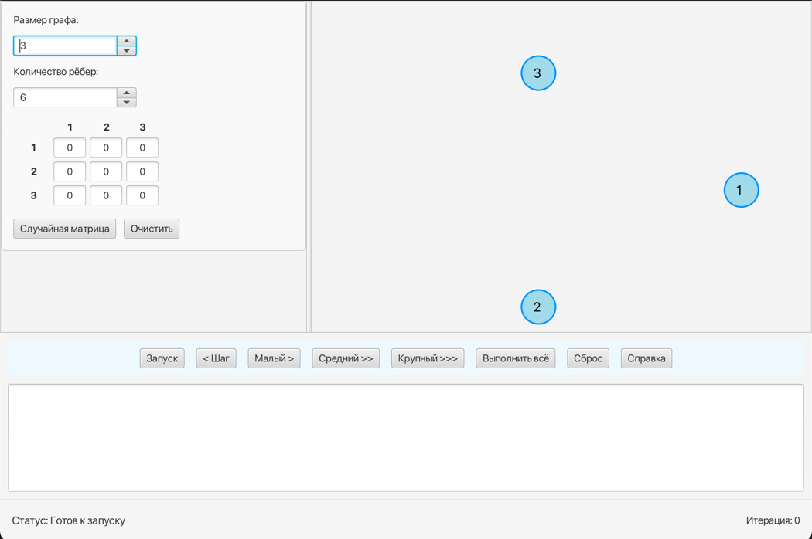
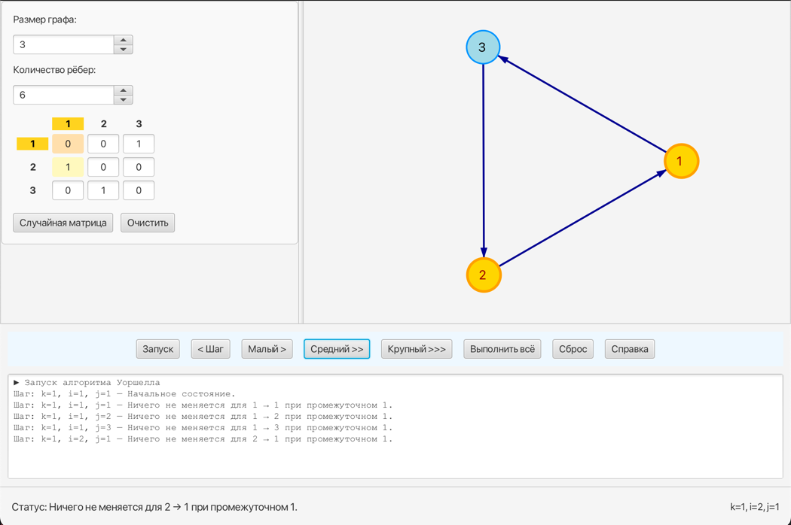
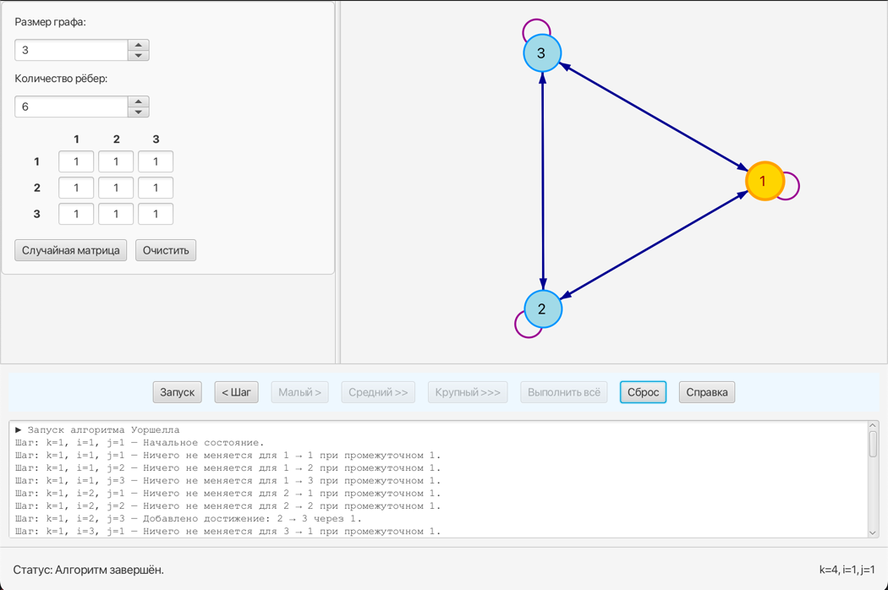

# Warshall Visualizer

> **Интерактивное графическое пособие по алгоритму Уоршелла**
> *Kotlin 17 • JavaFX 21 • Windows / macOS / Linux*

---

## Оглавление

1. [О проекте](#о-проекте)
2. [Скриншоты](#скриншоты)
3. [Особенности интерфейса](#особенности-интерфейса)
4. [Сборка и запуск](#сборка-и-запуск)
5. [Структура исходников](#структура-исходников)
6. [Архитектура кода](#архитектура-кода)
7. [Алгоритм Уоршелла — TL;DR](#алгоритм-уоршелла--tldr)
8. [Расширение и кастомизация](#расширение-и-кастомизация)
9. [FAQ](#faq)
10. [Авторы и руководитель](#авторы-и-руководитель)

---

## О проекте

**Warshall Visualizer** — учебная утилита, демонстрирующая работу алгоритма Уоршелла (транзитивное замыкание ориентированного графа). Пользователь может вводить матрицу смежности, генерировать случайный граф, наблюдать пошаговое выполнение, подсветку активных ячеек/рёбер и логи вычислений.

> Проект создан в рамках учебной практики.

---

## Скриншоты

*
*

---

## Особенности интерфейса

| Компонент        | Функции                                                                     |
| ---------------- | --------------------------------------------------------------------------- |
| **MatrixInput**  | Ввод 0/1, проверка ошибок, случайная генерация, динамический размер         |
| **GraphPanel**   | Авто‑раскладка вершин, drag‑and‑drop, добавление рёбер по клику, zoom/pan   |
| **ControlPanel** | Малый > / Средний >> / Крупный >>> шаги, шаг назад, лог, статус, справка    |
| **Подсветка**    | candidate (оранжевый пунктир), target (жёлтый), added (зелёный), активные V |

---

## Сборка и запуск

### Требования

* **JDK 17+**
* **Gradle Wrapper** поставляется в репозитории (доп. установка не нужна)

### Шаг 1. Клонирование

```bash
git clone https://github.com/your‑username/floyd_warshall.git
cd floyd_warshall
```

### Шаг 2. Сборка fat‑jar

```bash
./gradlew clean jar
```

Файл‑артефакт → `build/libs/floyd_warshall.jar`

### Шаг 3. Запуск

```bash
java -jar build/libs/floyd_warshall.jar
```

Gradle уже упаковал JavaFX внутрь, поэтому дополнительных `--module‑path` не требуется.

*Для отладки в IntelliJ IDEA запустите конфигурацию **Run → Main** — Gradle сам проставит VM‑аргументы.*

---

## Структура исходников

```text
src/main/kotlin
├── core/
│   └── WarshallClosure.kt          # Алгоритм Уоршелла + step‑history
├── ui/
│   ├── ControlPanel.kt             # Панель кнопок, лог, статус‑бар
│   ├── GraphDrawingUtils.kt        # Рисование рёбер, стрелок, лупов
│   ├── GraphPanel.kt               # Холст графа + drag‑and‑drop
│   ├── GraphStyleUtils.kt          # Цвета, размеры, стили
│   ├── MatrixInput.kt              # Таблица матрицы, валидация, подсветка
│   └── RandomGraph.kt              # Генератор случайных графов
└── Main.kt                         # Точка входа (fun main + Window)
```

---

## Архитектура кода

* **WarshallClosure** — инкапсулирует матрицу, индексы *(k,i,j)*, метод `stepForward()` и `stepBack()`, формирует `WarshallStep` для UI.
* **UI‑слой** разделён на самостоятельные компоненты (матрица, граф, панель управления) — они общаются через публичные методы, что упрощает тестирование и расширение.
* **Undo** реализован простым стеком снимков состояний.

---

## Алгоритм Уоршелла — TL;DR

```
for k in 0..n-1
  for i in 0..n-1
    for j in 0..n-1
      if A[i][j] == 0 && A[i][k] == 1 && A[k][j] == 1
         A[i][j] = 1
```

Визуализатор показывает этот процесс тремя уровнями «скорости» — **ячейка / строка / слой**.

---

## Расширение и кастомизация

| Хотите изменить… | Что править                                                     |
| ---------------- | --------------------------------------------------------------- |
| Цветовую схему   | `ui/GraphStyleUtils.kt`, CSS‑строки в `MatrixInput.kt`          |
| Максимальный `N` | `MatrixInput.MAX_SIZE`                                          |
| Горячие клавиши  | Добавить обработчики в `ControlPanel.kt`                        |
| Новый алгоритм   | Создайте класс по образцу `WarshallClosure.kt`, подключите к UI |

---

## FAQ

**Q:** Jar не запускается («no main manifest attribute»).
**A:** Проверьте, что в `build.gradle.kts` задан `Main-Class = MainKt` и пересоберите `./gradlew clean jar`.

**Q:** Можно ли экспортировать граф в PNG?
**A:** Да. Вызовите `graphPanel.view.snapshot(null, null)` и сохраните через `ImageIO.write()`.

---

## Авторы и руководитель

| Роль                     | Имя                                             |
| ------------------------ | ----------------------------------------------- |
| **Создатели**            | Пак Кирилл  •  Кузьмин Кирилл  •  Артём Наумкин |
| **Руководитель проекта** | Фирсов Михаил Александрович                     |

---

> Проект открыт для ваших pull‑request и звёздочек. Спасибо, что заинтересовались!
